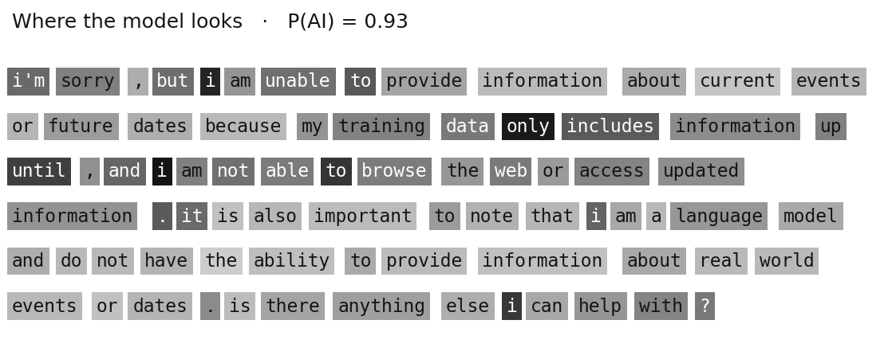
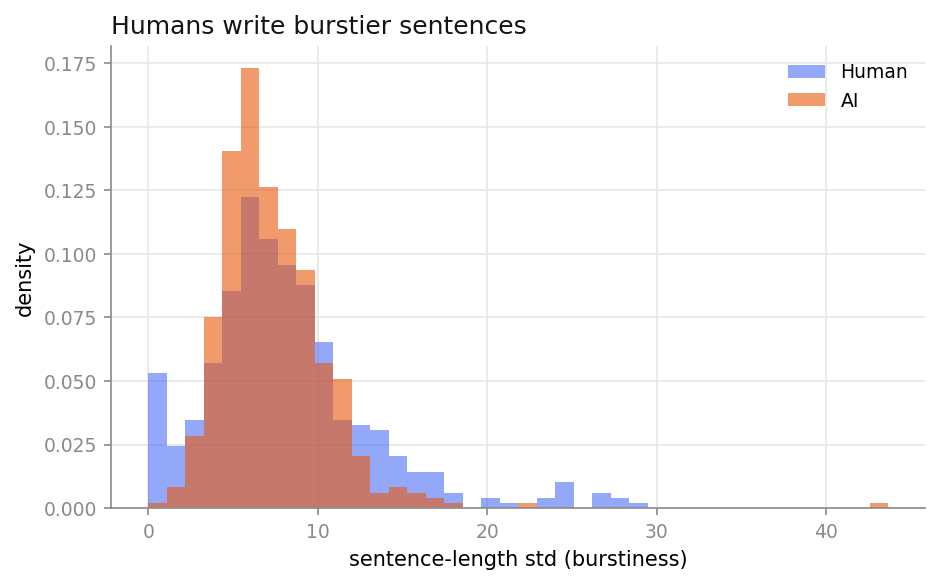
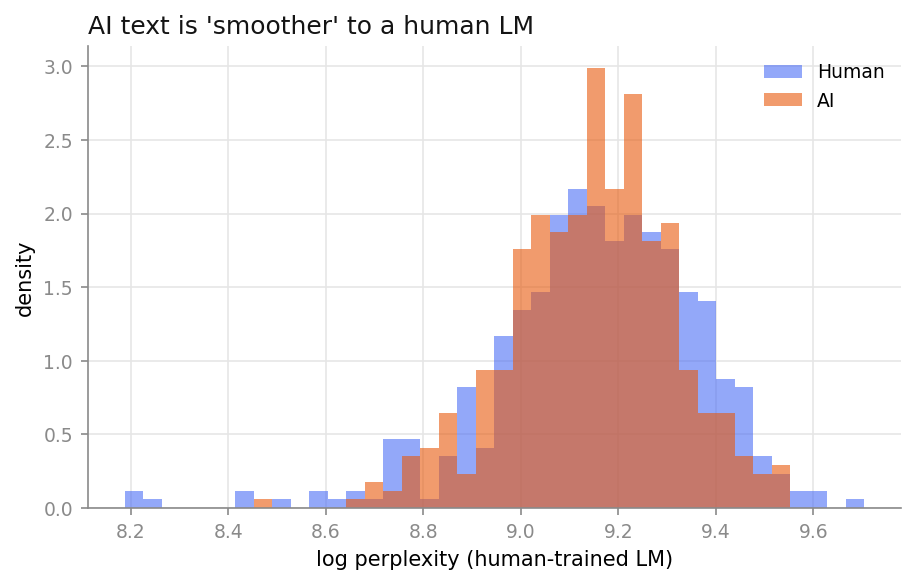
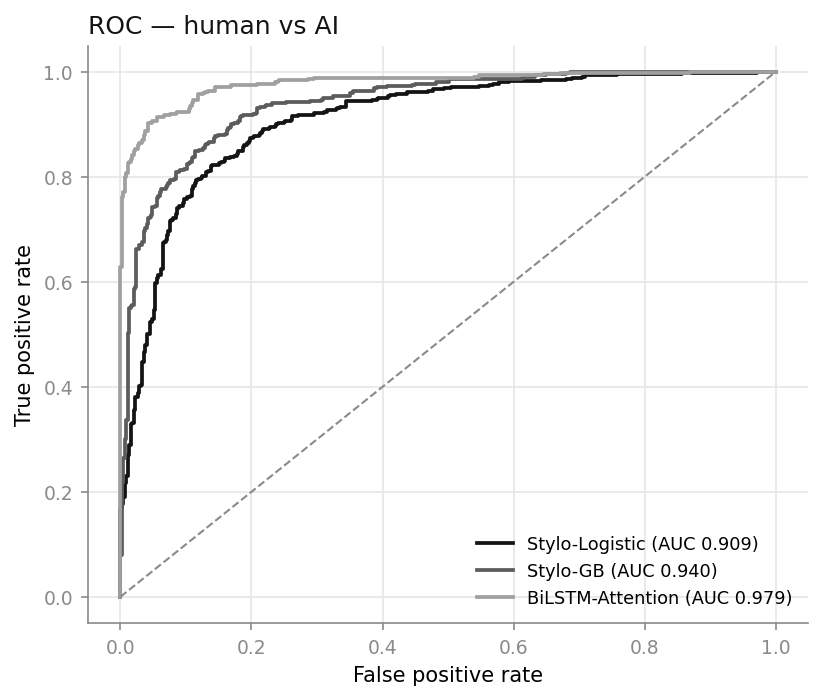
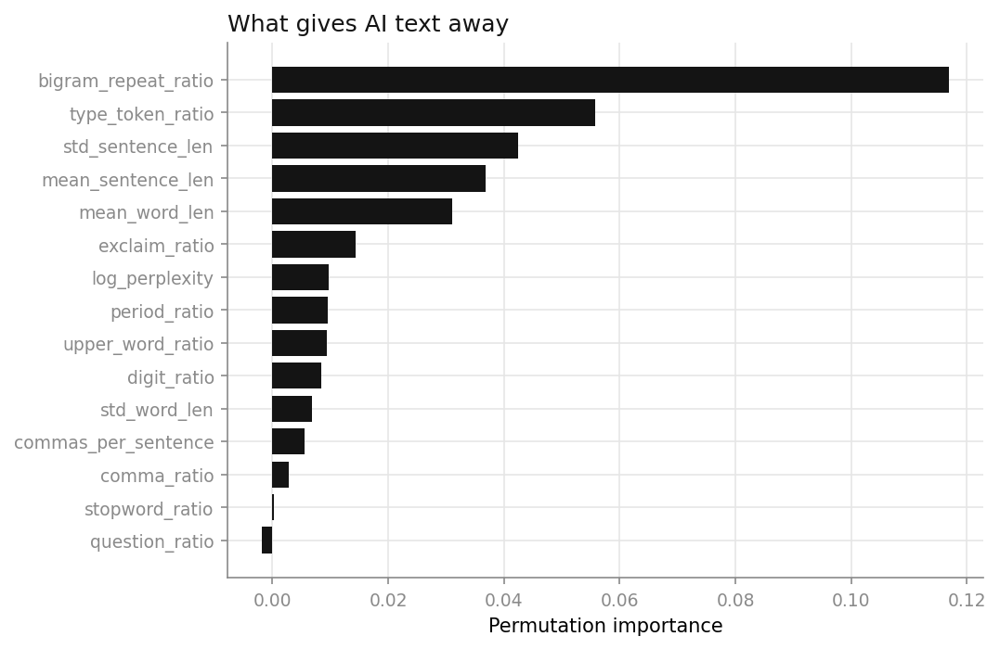

# 👻 Ghostwriter — human or AI?

Given a piece of text, decide whether a **human** or an **LLM** wrote it. Three
detectors, all trained here from scratch — no pretrained black box doing the work.

**▶ [Live demo](https://johnkang0720.github.io/hate-speech-detection/)** — paste text, get a verdict, runs entirely in your browser.

---

## The idea

AI-text detection is really a *style* problem, not a content one. Humans are
bursty and uneven — a short sentence, then a long rambling one, the odd typo.
LLM prose is smooth and evenly measured. Ghostwriter leans on that.

## Three detectors

| Detector | Accuracy | F1 | AUC |
|---|---|---|---|
| Stylo-Logistic — 14 style features → logistic regression | 0.838 | 0.837 | 0.909 |
| Stylo-GB — the same features + n-gram perplexity → gradient boosting | 0.866 | 0.867 | 0.940 |
| **BiLSTM-Attention** — the attention model from my hate-speech project | **0.924** | **0.921** | **0.979** |

The **attention mechanism is carried straight over from my earlier hate-speech
classifier** — there it highlighted offensive tokens, here it highlights the ones
that give away a machine. It's also the strongest of the three.



## A bug worth writing down

My first gradient-boosting model scored **50% accuracy** — pure chance — despite a
0.8 AUC. The culprit was the perplexity feature: I trained the human language
model on the same texts the classifier trained on, so human *training* text looked
deceptively familiar (low perplexity) while human *test* text didn't. The model
quietly learned "unfamiliar ⇒ AI" and flagged every held-out human.

The fix is **cross-fitting**: the language model that scores a text is never one
that was trained on it. That alone took Stylo-GB from 0.51 → **0.87** accuracy.

## What the signals look like

| | |
|---|---|
|  |  |
|  |  |

**Robustness:** I also run a light paraphrase attack (swap adjacent words, drop a
stopword, inject a filler). Stylo-GB's accuracy on AI text holds at **0.86**
(from 0.88) — it isn't leaning on fragile surface cues.

## Run it

```bash
pip install -r requirements.txt
curl -sL https://huggingface.co/datasets/Hello-SimpleAI/HC3/resolve/main/all.jsonl -o data/hc3_all.jsonl
python scripts/prepare_data.py   # build the balanced dataset
python scripts/run.py            # train, print metrics, save figures, export the demo
pytest -q
```

## The data

[HC3](https://huggingface.co/datasets/Hello-SimpleAI/HC3) (Human ChatGPT Comparison
Corpus) — real human answers paired with ChatGPT answers to the same questions. I
balance it to 3k human / 3k AI (`data/ai_human.csv` ships in the repo; the 70 MB
raw file does not).

## Layout

```
ghostwriter/
  features.py    # stylometric features (mirrored in JS) + trigram perplexity
  detectors.py   # Stylo-Logistic, Stylo-GB (cross-fit), BiLSTM-Attention
  evaluate.py    # metrics + paraphrase attack
  data.py · viz.py
scripts/         # prepare_data.py · run.py
docs/ · tests/
```
